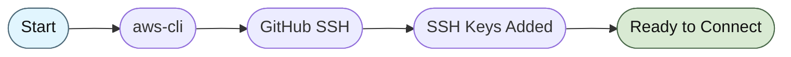
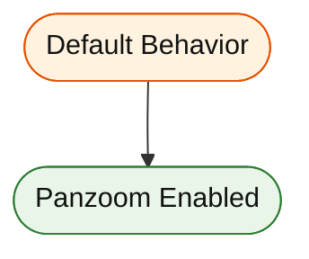
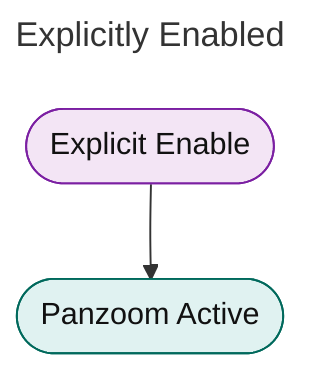

# Disabled Panzoom Example

## Example with Panzoom Disabled

This diagram has panzoom disabled via YAML metadata:

## Example with Panzoom Enabled (Default)

This diagram has panzoom enabled by default:

## Example with Explicit Enable

This diagram explicitly enables panzoom:

